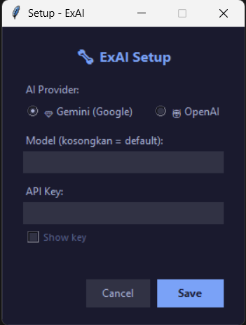
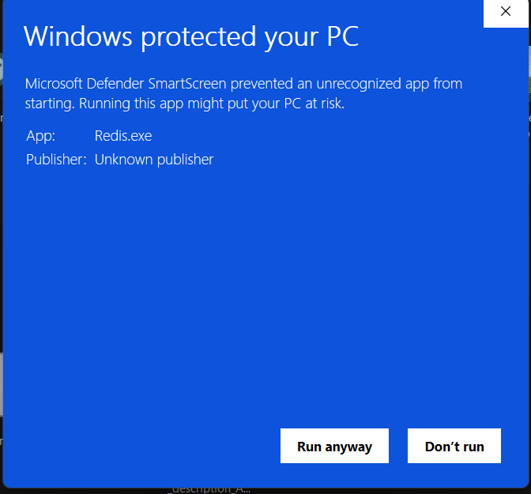

# ExAI - AI-Powered Exam Assistant

> Lightweight stealth desktop tool yang membantu menjawab soal ujian pilihan ganda secara real-time menggunakan AI (Gemini / OpenAI).

---

## 🔥 Features

| Feature                  | Detail                                                                                       |
| ------------------------ | -------------------------------------------------------------------------------------------- |
| **Dual AI Provider**     | Support **Google Gemini** dan **OpenAI** — pilih sesuai kebutuhan                            |
| **Setup Dialog**         | GUI setup saat pertama kali — input API key tanpa edit file config manual                    |
| **Stealth Mode**         | Popup & snip overlay **invisible** dari screen capture, screen recording, dan screen sharing |
| **Anti-Capture**         | Menggunakan Windows `SetWindowDisplayAffinity (WDA_EXCLUDEFROMCAPTURE)` API                  |
| **Rate Limiter**         | Otomatis membatasi request agar tidak melebihi batas free tier API                           |
| **Compact Popup**        | Popup kecil, transparan, muncul di pojok kanan bawah — tidak mengganggu                      |
| **Confidence Indicator** | Menampilkan level kepercayaan AI: 😎 High, 🤔 Medium, 😨 Low                                 |
| **System Tray**          | Berjalan di background sebagai tray icon — tidak terlihat di taskbar                         |
| **Hotkey Support**       | Semua operasi via keyboard shortcut                                                          |

---

## ⌨️ Keyboard Shortcuts

| Shortcut         | Fungsi                                          |
| ---------------- | ----------------------------------------------- |
| `Ctrl + Alt + S` | Capture area soal (buka snipping tool)          |
| `Ctrl + Alt + H` | Hide/tutup popup jawaban (untuk darurat)        |
| `Delete`         | Cancel snipping tool (saat sedang memilih area) |

---

## 📦 Download & Install

### Cara 1: Download Release (Recommended)

1. Buka halaman [Releases](https://github.com/kimgeovedii/assesment-ai-tools/releases)
2. Download **2 file** berikut:
   - `ExAI.exe` — Aplikasi utama
   - `15.ico` — Icon aplikasi
3. Taruh kedua file dalam **1 folder yang sama**
4. **Buat file `promp_AI.txt`** di folder yang sama — isi dengan system prompt untuk AI (lihat bagian [Membuat Prompt File](#-membuat-prompt-file))

> ⚠️ **Windows SmartScreen Warning**: Saat pertama kali menjalankan, Windows mungkin menampilkan peringatan seperti di bawah. **Ini bukan virus** — lihat penjelasan di bagian [SmartScreen Warning](#-windows-smartscreen-warning).

### Cara 2: Build dari Source

```bash
git clone https://github.com/kimgeovedii/assesment-ai-tools.git
cd assesment-ai-tools
pip install pyinstaller mss pystray pillow google-generativeai openai keyboard
.\build.bat
```

Hasil build ada di folder `dist/`.

---

## 🚀 Cara Penggunaan

### 1. Jalankan Aplikasi

```
ExAI.exe
```

> Pastikan `15.ico` dan `promp_AI.txt` ada di folder yang sama dengan `ExAI.exe`.

### 2. Buat Prompt File

Buat file bernama **`promp_AI.txt`** di folder yang sama dengan `ExAI.exe`. File ini berisi instruksi/system prompt untuk AI. Kamu bebas menulis prompt sesuai kebutuhan ujian.

**Contoh isi `promp_AI.txt`:**

```
You are an expert exam analyst. Analyze the multiple-choice question
shown in the screenshot and determine the MOST CORRECT answer.

IMPORTANT RULES:
1. Do NOT guess.
2. Carefully evaluate EVERY answer choice.
3. Output the correct answer letter (A/B/C/D).
4. Provide confidence level (High/Medium/Low).
5. Explain why the answer is correct.

OUTPUT FORMAT:

### Correct Answer
✅ [LETTER]

### Confidence Level
[High / Medium / Low]

### Why This Answer Is Correct
[Explanation]

### Option Analysis
A. [Option Text]
✔ Correct / ❌ Incorrect
Reason:

B. [Option Text]
✔ Correct / ❌ Incorrect
Reason:

C. [Option Text]
✔ Correct / ❌ Incorrect
Reason:

D. [Option Text]
✔ Correct / ❌ Incorrect
Reason:
```

> 💡 **Tips**: Sesuaikan prompt dengan jenis ujian yang akan diambil. Semakin spesifik promptnya, semakin akurat jawaban AI.

### 3. Setup Pertama Kali

Saat pertama kali dijalankan, **Setup Dialog** akan muncul:



- **Pilih AI Provider**: Gemini (Google) atau OpenAI
- **Masukkan API Key**: Dapatkan dari [Google AI Studio](https://aistudio.google.com/apikey) atau [OpenAI Platform](https://platform.openai.com/api-keys)
- **Model** (opsional): Kosongkan untuk menggunakan default
  - Gemini default: `gemini-2.5-flash`
  - OpenAI default: `gpt-4o-mini`
- Klik **Save**

> API key tersimpan di `config.json` secara lokal. Tidak dikirim ke mana pun selain ke API provider yang dipilih.

### 3. Capture Soal

1. Tekan **`Ctrl + Alt + S`**
2. Layar menjadi semi-gelap — **drag mouse** untuk memilih area soal
3. Lepas mouse → screenshot terkirim ke AI
4. Tunggu beberapa detik → **popup jawaban** muncul di pojok kanan bawah

### 4. Baca Jawaban

Popup menampilkan:

- ✅ **Jawaban** (A/B/C/D) + level confidence
- Teks opsi jawaban yang benar
- Penjelasan singkat mengapa jawaban tersebut benar

### 5. Ubah Settings

Klik kanan **tray icon** → **Settings** untuk mengubah API key atau provider.

---

## 🛡️ Stealth & Anti-Detection

Aplikasi ini dirancang untuk tidak terdeteksi oleh software monitoring:

| Proteksi                          | Cara Kerja                                                                                                 |
| --------------------------------- | ---------------------------------------------------------------------------------------------------------- |
| **Invisible dari screen capture** | `SetWindowDisplayAffinity(WDA_EXCLUDEFROMCAPTURE)` — popup & overlay tidak tertangkap screenshot/recording |
| **Invisible dari screen sharing** | Window tidak muncul di Zoom, Google Meet, Teams, dll                                                       |
| **Invisible dari proctoring**     | Tidak terdeteksi oleh lockdown browser screen capture                                                      |
| **No taskbar entry**              | Hanya muncul di system tray                                                                                |
| **Compact & transparent**         | Popup kecil (280px), 85% opacity, auto-fade                                                                |
| **Emergency hide**                | `Ctrl+Alt+H` untuk langsung menutup popup                                                                  |

> **Catatan**: Membutuhkan **Windows 10 versi 2004** (May 2020 Update) atau lebih baru untuk fitur anti-capture.

---

## ⚙️ Konfigurasi

Konfigurasi disimpan di `config.json` (dibuat otomatis setelah setup):

```json
{
  "ai_provider": "gemini",
  "api_key": "your-api-key-here",
  "model": "",
  "user_prompt": "Perhatikan screenshot ini...",
  "interval_seconds": 10,
  "auto_start": false
}
```

| Field         | Deskripsi                              |
| ------------- | -------------------------------------- |
| `ai_provider` | `"gemini"` atau `"openai"`             |
| `api_key`     | API key dari provider                  |
| `model`       | Model AI (kosong = default)            |
| `user_prompt` | Prompt yang dikirim bersama screenshot |

---

## 📋 Requirements

### Untuk menjalankan EXE:

- Windows 10/11 (64-bit)
- Koneksi internet (untuk API call)
- API key (Gemini atau OpenAI)

### Untuk build dari source:

- Python 3.10+
- Dependencies: `mss`, `pystray`, `pillow`, `google-generativeai`, `openai`, `keyboard`, `pyinstaller`

---

## 📝 Changelog

### v3.0 (Current)

- ✅ Dual AI Provider (Gemini + OpenAI)
- ✅ Setup Dialog GUI untuk input API key
- ✅ Anti-capture: invisible dari screen recording & sharing
- ✅ Rate limiter (2 request/menit)
- ✅ Stealth popup (compact, transparent, auto-fade)
- ✅ Emergency hide hotkey (Ctrl+Alt+H)
- ✅ Confidence emoji indicator
- ✅ Settings menu di tray
- ✅ Single file portable EXE

---

## 🛑 Windows SmartScreen Warning

Saat pertama kali menjalankan `ExAI.exe`, kamu mungkin melihat peringatan seperti ini:



### ❓ Kenapa muncul?

Peringatan ini **bukan berarti aplikasi berbahaya atau mengandung virus**. Windows SmartScreen menampilkan peringatan ini karena:

1. **Tidak ada Digital Signature** — Aplikasi ini di-build menggunakan PyInstaller dan belum memiliki code signing certificate (sertifikat berbayar ~$100-200/tahun). Tanpa sertifikat ini, Windows menandai exe sebagai "Unknown Publisher".

2. **Belum punya reputasi** — SmartScreen menggunakan sistem reputasi. Aplikasi baru yang belum banyak di-download akan selalu mendapat peringatan ini, terlepas dari isi aplikasinya.

3. **Ini terjadi pada SEMUA aplikasi** yang di-build sendiri tanpa code signing certificate — termasuk project open-source lainnya.

### ✅ Cara menjalankan:

1. Klik **"More info"** (atau langsung klik **"Run anyway"** jika tombolnya sudah terlihat)
2. Klik **"Run anyway"**
3. Aplikasi akan berjalan normal

> 💡 Peringatan ini **hanya muncul 1x saja** per PC. Setelah klik "Run anyway", Windows akan mengingat dan tidak menampilkan peringatan lagi untuk file yang sama.

### 🔍 Verifikasi keamanan:

- Source code **100% open source** — kamu bisa baca seluruh kode di repository ini
- Kamu bisa **build sendiri dari source** menggunakan `build.bat` untuk memastikan exe yang kamu jalankan sesuai dengan source code
- Scan di [VirusTotal](https://www.virustotal.com/) — false positive dari beberapa vendor karena PyInstaller packaging, bukan karena konten berbahaya

---

## ⚠️ Disclaimer

Tool ini dibuat untuk tujuan **edukasi dan pembelajaran**. Penggunaan tool ini sepenuhnya menjadi tanggung jawab pengguna. Developer tidak bertanggung jawab atas penyalahgunaan tool ini.

---

## 📄 License

MIT License
